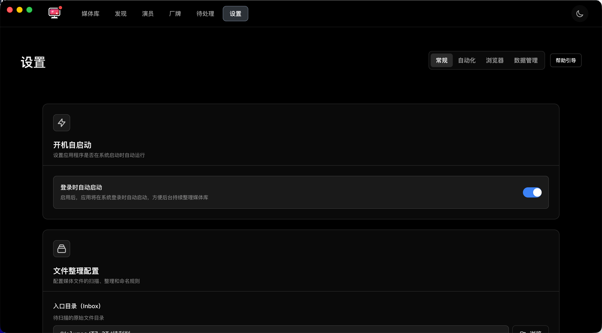

# cc

简洁易用的本地媒体管理与刮削应用。帮助你把分散的本地视频整理成优雅可浏览的媒体库：扫描文件、自动识别信息、生成海报和预览、按规则整理入库，并支持播放与转码。

注意：请仅在遵守所在地区法律法规的前提下使用本应用。

## 下载与安装（macOS）

仅提供 macOS 版本。

1) 从发行页下载 dmg 或 zip 安装包，打开后将应用拖动到“应用程序”。
2) 首次打开若提示“无法验证开发者/应用已损坏”，这是 macOS Gatekeeper 的常见限制，你可以：
   - 方案 A：在 Finder 中右键应用选择“打开”，随后再次点击“打开”。
   - 方案 B（遇到“已损坏”或仍无法打开时）：在“应用程序”中放好应用后，打开“终端”执行以下命令移除隔离标记，然后重新打开应用：

     sudo xattr -r -d com.apple.quarantine "/Applications/cc.app"

3) 首次使用建议在“系统设置 → 隐私与安全 → 文件与文件夹/完全磁盘访问”中，允许应用访问你的媒体目录（Inbox/Library/Quarantine）。

将应用固定到 Dock 以便快速启动。

## 快速开始（首次使用）

1) 启动应用后会进入引导，依次完成以下配置：
   - Inbox：放入待整理的视频文件
   - Library：用于存放整理完成的文件
   - Quarantine：隔离重复/无效/损坏文件

2) 将你已有的视频复制或移动到 Inbox 目录中。

3) 回到应用，点击“扫描”开始识别和刮削，应用会：
   - 自动从文件名提取编号并抓取标题、封面、演员、标签等信息
   - 生成封面图与预览小视频（首次可能稍慢）
   - 将文件按规则整理到 Library 中

小提示：文件名包含清晰的编号（如 ABC-123）可显著提升识别准确率。

## 日常使用

- Library：以卡片方式浏览你的媒体库，支持搜索、筛选与收藏。点击卡片可查看详情与预览。
- Discover：基于偏好与质量的推荐，支持一键加入媒体库。
- Player：内置播放器可直接播放本地文件；若设备不支持编码，可在“转码”中转换为通用格式再播放。
- Settings：管理目录、自动化、通知、清理缓存等偏好项。

示例 - 设置页（常规）

## 整理与命名

- 应用会根据识别的信息在 Library 中创建规范的目录与文件名，避免杂乱无章。
- 如果识别错误或不完整，可在卡片详情中“重新刮削”或手动编辑标题/标签等信息。

## 预览与转码

- 预览：为媒体生成短预览，便于快速浏览内容；生成过程需要时间，完成后会自动显示。
- 转码：播放卡顿、不兼容或体积过大时，可发起转码以获得更流畅、更通用的文件。

## 问题处理

- 重复/损坏：扫描时会自动识别，相关文件会被移动到 Quarantine 目录，你可以在应用中查看并处理。
- 刮削失败：通常是网络或来源临时不可用导致，稍后重试；确保文件名包含可识别编号也很重要。
- 海报不显示：
  - 确认应用有权限访问设置中的 Library 与 Inbox 目录（尤其是 macOS 的隐私权限）。
  - 打开“设置 → 清理”，尝试清理并重建海报缓存。
  - 如问题仅在 macOS 关闭窗口后重新打开出现，请完全退出应用后再启动一次。

## 隐私与数据

- 应用默认在本地工作，不上传你的媒体或个人数据。
- 刮削时会访问公开信息源，仅请求必须的元数据。
- 媒体与封面保存在你设置的目录（或应用私有数据目录）中，便于备份与迁移。

## 常见问题（FAQ）

- 无法识别或识别错误？
  - 确保文件名包含清晰编号（例如 ABC-123），并尽量移除多余字符。
  - 在详情中执行“重新刮削”或手动修正标题与标签。

- 首次打开没有任何内容？
  - 请先在引导中配置 Inbox/Library/Quarantine，并将文件放入 Inbox，然后点击“扫描”。

- 预览或封面生成很慢？
  - 首次生成需要一定时间；生成完成后会缓存，同一媒体下次打开会更快。

- 播放不流畅或无法播放？
  - 尝试在详情页使用“转码”生成通用格式后再播放。

- 如何迁移到新电脑？
  - 拷贝 Library 目录和应用数据目录（包含海报与缓存）到新设备；在新设备上设置相同的 Library 路径后即可自动识别。

## 反馈与支持

- 建议在应用内截图或录屏描述问题出现的步骤，并附上关键信息（文件名、操作路径、时间点）。
- 如需进一步协助，请在提交反馈时尽量包含：你的系统版本、应用版本、是否能稳定复现、是否已尝试清理缓存/重启。

## 免责声明

- 请依据所在地法律合规使用本应用。
- 你应对导入到应用中的所有内容拥有合法的使用权。
